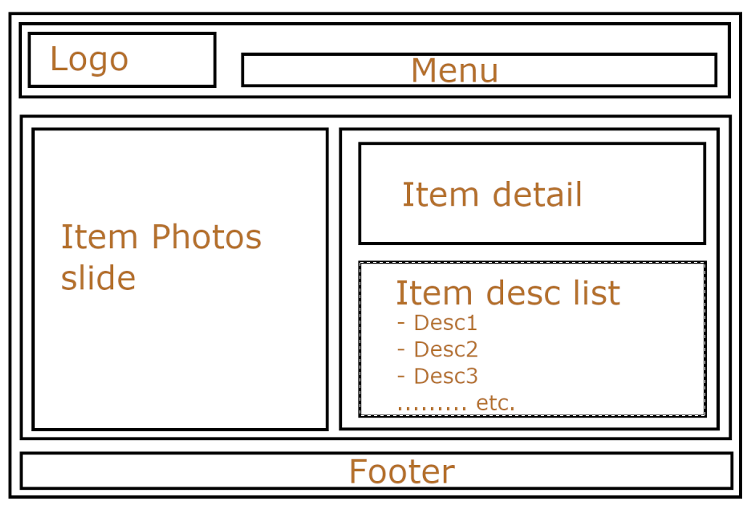

/* All following exams please using Javascript only 20220922 */

## 1. sort Data

```javascript
/**
 There is an array, each item has such format:
 {firstName: 'xxx', lastName: 'xxx', customerID: 'xxx', note: 'xxx', profession: ‘xxx’}
 lastName, note can be empty, customerID can only be a set of digital numbers.
 profession can only have ‘student’, ‘freelancer’, ‘productOwner’, ‘engineer’ or
 ‘systemAnalytics’.
 **/
/**
 Q1. Please follow the principle (‘firstName’ + ‘lastName’ + ‘customerID’) to sort this
 array and print it out.
 **/
function sortUserName(user) {

    const arr = users
        .map(user => ({
            ...user,
            userName: `${user.firstName || ''} ${user.lastName || ''} ${user.customerID || ''}`
        }))
        .sort((a, b) => a.userName.localeCompare(b.userName));

    console.log(arr);
}

/**
 Q2. Please sort by ‘profession’ to follow the principle.
 (‘systemAnalytics’ > ‘engineer’ > ‘productOwner’ > ‘freelancer’ > ‘student’’)
 **/
function sortByType(user) {

    const professionLevel = {
        student: 1,
        freelancer: 2,
        productOwner: 3,
        engineer: 4,
        systemAnalytics: 5,
    }

    // -1 : a 比 b 小 ( a 向前移動 )
    //  0 : 相同
    //  1 : a 比 b 大 ( a 向後移動 )
    const arr = users.sort((a, b) => professionLevel[a.profession] - professionLevel[b.profession]);

    // 將分數較大的往後放~~
    console.log(arr);
}
```

---

## 2. css quiz

```vue
<template>
  <div class="container">
    <div class="header">5/8 外出確認表</div>
    <div class="content">
      <ol class="shop-list">
        <li class="item">麵包</li>
        <li class="item">短袖衣服</li>
        <li class="item">飲用水</li>
        <li class="item">帳篷</li>
      </ol>
      <ul class="shop-list">
        <li class="item">暈車藥</li>
        <li class="item">感冒藥</li>
        <li class="item">丹木斯</li>
        <li class="item">咳嗽糖漿</li>
      </ul>
    </div>
    <div class="footer">以上僅共參考</div>
  </div>
</template>

<style>
  .container {
    font-size: 14px;
  }
  .container .header {
    font-size: 18px;
  }
  .container .shop-list {
    list-style: none;
    margin-left: -15px;
  }
  .container .shop-list li.item {
    color: green;
  }
  .container .shop-list .item {
    color: blue;
  }
</style>
```

### 考題 & 答案

1. 解釋為何 `.container .shop-list .item` 區塊設定的文字顏色沒有生效 ? 請將其修正讓 first row 套用之 

因為 `.container .shop-list li.item` 多一層 li 因此權重比 `.container .shop-list .item` 大

i.  將 `.container .shop-list .item` 調整成 `.container .shop-list .item:nth-child(1)` 只讓 first row 變成藍色字
ii. 將 `.container .shop-list li.item` 調整成 `.container .shop-list .item` 就可讓藍字設定生效

```css
 .container .shop-list .item {
    color: green;
}

.container .shop-list .item:nth-child(1) {
    color: blue;
}
```

2. 條紋效果（striped effect）- "Write styling make every other line give background color to next one"

```css
.container .shop-list .item:nth-child(odd) {
    color: blue;
}
```

---

## 3. Unique the Data

```javascript
/**
 let items = [1, 1, 1, 5, 2, 3, 4, 3, 3, 3, 3, 3, 3, 7, 8, 5, 4, 9, 0, 1, 3, 2, 6, 7, 5,
 4, 4, 7, 8, 8, 0, 1, 2, 3, 1];
 Please write down a function to console log unique value from this array.
 **/
function getUniqueNumber(items) {
    const set = new Set(items);
    const uniqueArr = [...set];
    console.log(uniqueArr.join(','));
}
```

## 4. HTML Tag

> What is different between `<section>` and `<article>`, can you make an example how you
will be using it?

### answer

- article 適合內容較完整且能獨立使用（例如：文章、新聞、視頻），任何可獨立存在的區塊。
- section 適合用來區分有主題性或是明確意義的區塊（例如：一個章節、一個段落、聯絡資訊區塊），完整性比較不高且通常帶有標題（h1~h6）。

```html
<!DOCTYPE html>
<html lang="zh-tw">
<head>
    <meta charset="UTF-8">
    <meta name="viewport" content="width=device-width, initial-scale=1.0">
    <title>Section vs Article Example</title>
</head>
<body>
    <header>
        <h1>My Blog</h1>
    </header>

    <!-- Section Example -->
    <section>
        <h2>Technology Updates</h2>
        <p>This section covers the latest updates in technology.</p>

        <!-- Article Example 1 -->
        <article>
            <h3>AI in 2024</h3>
            <p>Artificial Intelligence has reached new milestones this year...</p>
        </article>

        <!-- Article Example 2 -->
        <article>
            <h3>Quantum Computing</h3>
            <p>Quantum computers are now accessible to more researchers...</p>
        </article>
    </section>

    <!-- Another Section -->
    <section>
        <h2>Health and Wellness</h2>
        <p>Discover the latest tips and trends in health and wellness.</p>

        <!-- Article Example -->
        <article>
            <h3>Yoga for Stress Relief</h3>
            <p>Practicing yoga daily can significantly reduce stress...</p>
        </article>
    </section>

    <footer>
        <p>&copy; 2024 My Blog</p>
    </footer>
</body>
</html>
```


參考資訊 :
- section: https://html.spec.whatwg.org/multipage/sections.html#the-section-element
- article: https://html.spec.whatwg.org/multipage/sections.html#the-article-element


## 5. css boxing model

> Please explain about what is CSS boxing model and the layout components that it
consists of.

### answer

下方是 內容(content)、內距 (padding)、邊框 (border) 和外距 (margin) 的示意圖。

```
+-------------------------------+
|          Margin              |
|   +-----------------------+  |
|   |      Border           |  |
|   |  +-----------------+  |  |
|   |  |    Padding      |  |  |
|   |  | +-------------+ |  |  |
|   |  | |   Content   | |  |  |
|   |  | +-------------+ |  |  |
|   |  +-----------------+  |  |
|   +-----------------------+  |
+-------------------------------+
```

盒子模式(box-sizing)有兩種，一種是 `content-box; (預設值)` 另一種是 `border-box;`

如果設定 width:200px , padding:8px , border:1px

#### box-sizing: content-box; (預設值)

實際寬度是 200px + 8px*2 + 1px*2 

#### box-sizing: border-box;

實際寬度是 200px

---

## 6. css priority

> Can you explain CSS priority, and what principle are your used to writing CSS
stylesheet.

#### explain CSS priority

利用下述分數進行加總 , 將分數較高者 , 套用那個樣式

- Inline styles: 1000
- IDs (#id): 100
- Classes (.class), attributes ([attr]), and pseudo-classes (:hover): 10
- Elements (div, h1, etc.) and pseudo-elements (::before): 1

> !important 有最高的優先級 , 覆蓋沒有 !important 的定義 , 如果有兩個 !important 那還是會比較權重分數 , 不過要避免使用 !important {{{(>_<)}}}

#### principle writing css

最近使用 TailwindCSS 盡量用 utility-first CSS 方式定義

## 7. Semantic HTML

> Can you introducing some of Semantic HTML elements that you already know and how you
used it ever, please make some example.

- 參考資料 : https://html5doctor.com/resources/#flowchart

#### 1. <header> 頁首

```html
<header>
  <h1>My Website</h1>
  <nav>
    <ul>
      <li><a href="#home">Home</a></li>
      <li><a href="#about">About</a></li>
      <li><a href="#contact">Contact</a></li>
    </ul>
  </nav>
</header>
```

#### 2. <nav> 導覽列

```html
<nav>
<ul>
  <li><a href="#home">Home</a></li>
  <li><a href="#about">About</a></li>
  <li><a href="#contact">Contact</a></li>
</ul>
</nav>
```

#### 3. <aside> 側邊欄

```html
<aside>
    <h3>Related Articles</h3>
    <ul>
        <li><a href="#article1">Introduction to CSS</a></li>
        <li><a href="#article2">JavaScript Basics</a></li>
    </ul>
</aside>
```

#### 4. <main> 主要內容

```html
<main>
    <h1>Welcome to Our Website</h1>
    <p>Here you’ll find the best resources for learning web development.</p>
</main>
```

#### 5. `<figure>` and `<figcaption>` 圖文說明塊

```html
 <figure>
    
    <figcaption>A beautiful landscape during sunset.</figcaption>
</figure>
```

#### 6. `<kbd>` - Keyboard Input element

```html
<p>Please press <kbd>Ctrl</kbd> + <kbd>Shift</kbd> + <kbd>R</kbd> to re-render an MDN page.</p>
```

#### 7. `<form>` 表單

```html
<form action="" method="get" class="form-example">
    <div class="form-example">
        <label for="name">Enter your name: </label>
        <input type="text" name="name" id="name" required />
    </div>
    <div class="form-example">
        <label for="email">Enter your email: </label>
        <input type="email" name="email" id="email" required />
    </div>
    <div class="form-example">
        <input type="submit" value="Subscribe!" />
    </div>
</form>
```

#### 8. `<blockquote>` The Block Quotation element

> 區塊性的說明 , 引用的原話

```html
<div>
    <blockquote cite="https://www.huxley.net/bnw/four.html">
        <p>Words can be like X-rays, if you use them properly—they’ll go through anything. You read and you’re pierced.</p>
    </blockquote>
    <p>—Aldous Huxley, <cite>Brave New World</cite></p>
</div>
```

#### 9. <footer> 頁尾

```html
<footer>
  <p>&copy; 2024 My Website. All rights reserved.</p>
</footer>
```

## 8. SEO Html

> The photo below is a page structural layer, please according to SEO friendly rules
write down HTML base structure. Note. Mobile friendly first. 



```html

<body>
<!- HTML structure start -->
</body>
```

```html
<!DOCTYPE html>
<html lang="en">
<head>
    <meta charset="UTF-8">
    <meta name="viewport" content="width=device-width, initial-scale=1.0">
    <meta name="description" content="A detailed page showcasing item photos, descriptions, and features.">
    <meta name="keywords" content="item photos, product details, descriptions, features">
    <title>Item Details Page</title>
    <style>
        /* Minimal CSS for mobile-first */
        body {
            font-family: Arial, sans-serif;
            margin: 0;
            padding: 0;
            display: flex;
            flex-direction: column;
            min-height: 100vh;
        }
        header, footer {
            background-color: #f4f4f4;
            padding: 10px;
            text-align: center;
        }
        main {
            display: flex;
            flex-wrap: wrap;
            padding: 10px;
            flex-grow: 1;
        }

        .menu li{
            list-style: none;
        }

        .menu > ul{
            padding: 0;
        }

        .photos, .details {
            flex: 1 1 100%; /* Default to full width on mobile */
            margin: 10px 0;
        }
        .details {
            display: flex;
            flex-wrap: wrap;
        }
        .item-detail, .item-desc-list {
            flex: 1 1 100%; /* Default to full width on mobile */
            margin: 5px 0;
        }
        @media (min-width: 768px) {
            .photos {
                flex: 2; /* Take 2/3 width on larger screens */
            }
            .details {
                flex: 1; /* Take 1/3 width */
            }
            .item-detail, .item-desc-list {
                flex: 1 1 50%; /* Split the details into two columns */
            }
            .menu ul {
                display: flex;
                gap: 16px;
            }
            header{
                display: flex;
                justify-content: space-between;
                align-items: center;
                padding: 8px 32px;
            }
        }
    </style>
</head>
<body>
<!-- Header Section -->
<header>
    <div class="logo">
        <h1>Logo</h1>
    </div>
    <nav class="menu">
        <ul>
            <li><a href="#home">Home</a></li>
            <li><a href="#about">About</a></li>
            <li><a href="#contact">Contact</a></li>
        </ul>
    </nav>
</header>

<!-- Main Content -->
<main>
    <!-- Item Photos Slide Section -->
    <section class="photos">
        <h2>Item Photos</h2>
        <p>[Image slider here]</p>
    </section>

    <!-- Item Details Section -->
    <section class="details">
        <div class="item-detail">
            <h2>Item Details</h2>
            <p>Here are the detailed features of the item...</p>
        </div>
        <div class="item-desc-list">
            <h2>Item Description List</h2>
            <ul>
                <li>Desc 1</li>
                <li>Desc 2</li>
                <li>Desc 3</li>
                <li>... etc.</li>
            </ul>
        </div>
    </section>
</main>

<!-- Footer Section -->
<footer>
    <p>&copy; 2024 Andrew Store. All rights reserved.</p>
</footer>
</body>
</html>

```
